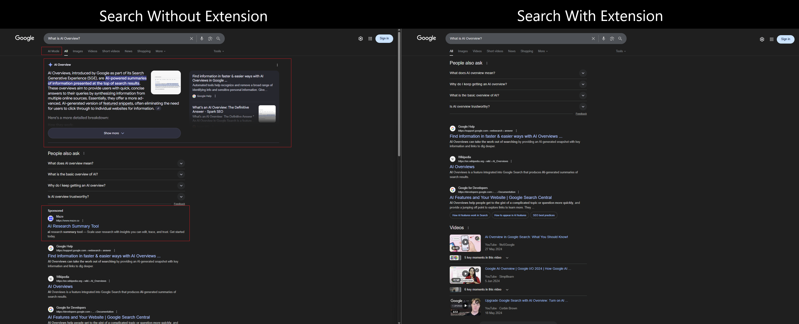

# AI Overview Remover

**A simple and effective Chrome extension to hide AI Overviews, AI Mode, and sponsored results from Google search pages, giving you a cleaner, more traditional search experience..**

---

## 🚀 Features

- **Hide AI Overview** Removes the new AI-generated summaries at the top of search results.

- **Hide AI Mode** Hides the "AI Mode" button on the search results page.

- **Hide Sponsored Results** Optionally removes sponsored advertisements from your search results.

### 📸 Screenshot

---

### 💻 Installation

#### 1. Chrome Web Store

Install [Chrome Web Store](https://chromewebstore.google.com/detail/ai-overview-remover/mbfboihhhoaklaafehggofgjgnhkheah?hl=en)

#### 2. Load Unpacked

1. **Clone or Download**: Clone this repository or download the ZIP file and extract it.
2. **Open Extensions**: Navigate to chrome://extensions in your Chrome browser.
3. **Enable Developer Mode**: Toggle the "Developer mode" switch in the top-right corner.
4. **Load Unpacked**: Click the "Load unpacked" button.
5. **Select Folder**: Choose the folder where you saved the extension files.

The "AI Overview Remover" icon should now appear in your browser's toolbar.

### ⚙️ Usage

Click the extension icon in your toolbar to open the popup menu. From there, you can toggle which elements you want to hide. The settings will save automatically.

### 💬 Feedback & Contributions

Found a bug or have an idea for a new feature? We'd love to hear from you! Please use our feedback form to let us know.

[Something wrong or missing?](https://forms.gle/zS9NmAoqoJ2xc35j6)

### 📄 License

This project is open-sourced under the [MIT License](https://opensource.org/licenses/MIT)
